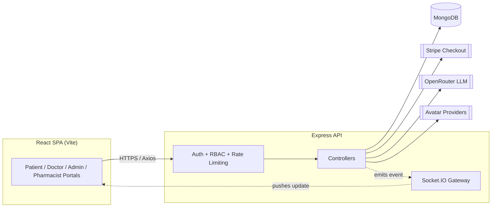

<div align="center">

# 🏥 HealthSync

### Multi-Role Healthcare Management Platform

A full-stack platform connecting patients, doctors, pharmacists, and administrators — appointment scheduling, AI-assisted symptom triage, e-prescriptions, billing, and pharmacy inventory in one system.

[](https://react.dev/)
[](https://vitejs.dev/)
[](https://expressjs.com/)
[](https://www.mongodb.com/)
[](https://socket.io/)
[](https://tailwindcss.com/)
[](https://stripe.com/)
[](#license)

[Report Bug](https://github.com/MuzammilCk/HealthCare/issues) · [Request Feature](https://github.com/MuzammilCk/HealthCare/issues)

</div>

---

<details>
<summary><strong>Table of Contents</strong></summary>

- [Overview](#overview)
- [Key Features](#key-features)
- [Tech Stack](#tech-stack)
- [Architecture](#architecture)
- [Project Structure](#project-structure)
- [Getting Started](#getting-started)
- [API Reference](#api-reference)
- [Security](#security)
- [Roadmap](#roadmap)
- [Contributing](#contributing)
- [License](#license)

</details>

## Overview

HealthSync is a full-stack healthcare management platform that brings patients, doctors, pharmacists, and hospital administrators onto a single system. It covers the full care loop — doctor discovery, appointment booking, AI-assisted symptom triage, digital prescriptions, billing, and pharmacy inventory — behind a JWT and role-based access control layer, with Socket.IO powering real-time updates across every portal.

The platform ships with a reference dataset of 140 doctors across all 14 districts of Kerala, India, spanning five specializations, so it's fully explorable out of the box.

## Key Features

### 🧑‍⚕️ Patient Portal
- Doctor discovery filtered by district and specialization
- Appointment booking against a doctor's live availability calendar
- **AI Symptom Checker** — LLM-based triage before booking, logged for review
- E-prescriptions with one-tap refill requests
- Consolidated medical history timeline
- Bill viewing and payment via Stripe Checkout or a mock gateway for local dev
- Live in-app notifications for confirmations, rejections, and reschedules

### 👨‍⚕️ Doctor Portal
- Appointment queue with accept / reject / reschedule / mark-missed actions
- Configurable weekly availability that drives patient-facing slot generation
- Digital prescription authoring linked to the patient's file
- Full patient file view with medical history
- Follow-up visit scheduling
- Consultation bill generation
- KYC submission — new accounts stay `pending_approval` until admin sign-off

### 🛡️ Admin Console
- KYC review queue for onboarding doctors
- Full CRUD over doctors, hospitals, specializations, and inventory
- Platform-wide AI symptom-check audit log
- Central oversight of the doctor directory and hospital network

### 💊 Pharmacist Portal
- Prescription fulfillment dashboard with dispense-status tracking
- Visibility into hospital medicine stock and low-stock alerts

### ⚙️ Platform-Wide
- JWT auth in httpOnly cookies with 4-role RBAC (patient / doctor / admin / pharmacist)
- Resource-ownership checks — a valid token alone can't read someone else's records
- Socket.IO real-time layer with online-presence tracking
- Graceful-degradation avatar pipeline: UI Avatars → DiceBear → RoboHash → static default, with optional DALL·E 3 / Stability AI generation when keys are configured
- Structured logging (Winston) and HTTP access logs (Morgan)
- Dark / light theme support

## Tech Stack

| Layer | Technology |
|---|---|
| **Frontend** | React 18 · Vite 7 · React Router 6 (data router) · Tailwind CSS 3 · shadcn/ui · Framer Motion · GSAP · Axios · React Hot Toast |
| **Backend** | Node.js · Express 4 · Socket.IO 4 · JWT · bcryptjs · Multer + Sharp · Winston + Morgan |
| **Database** | MongoDB (Mongoose 7 ODM) |
| **Payments** | Stripe (test mode) + mock payment gateway for offline development |
| **AI** | OpenRouter-hosted LLMs (symptom triage) · optional DALL·E 3 / Stability AI (avatar generation) |
| **Security** | httpOnly JWT cookies · RBAC · ownership middleware · input sanitization · rate limiting · CSP/HSTS headers |
| **Tooling** | Vite dev server · nodemon · CSV-driven database seeding |

> The frontend is JavaScript/JSX. `tsconfig.json` is present from initial tooling scaffolding, but the codebase does not currently use TypeScript.

## Architecture



The SPA talks to the Express API over REST for standard reads/writes and holds a persistent Socket.IO connection for live notifications. Controllers are the single point of contact with MongoDB and every external service (Stripe, the OpenRouter LLM, avatar providers) — the client never calls third parties directly. Every request passes through JWT verification, role authorization, and, for patient/doctor-scoped resources, an ownership check before it reaches a controller.

## Project Structure

<details>
<summary>Expand file tree</summary>

```
HealthCare/
├── backend/
│   ├── config/              # Winston logger configuration
│   ├── controllers/         # 13 route-handler modules
│   ├── middleware/          # auth (JWT/RBAC), security, error handling
│   ├── models/               # 12 Mongoose schemas
│   ├── routes/                # 13 REST route modules
│   ├── scripts/
│   │   └── migrations/       # One-off data migrations
│   ├── utils/                  # Notification + avatar-generation helpers
│   ├── doctor.csv               # Seed dataset — 140 doctors, 14 Kerala districts
│   ├── seed*.js                  # Database seeding scripts
│   └── server.js                  # Express + Socket.IO entrypoint
│
├── frontend/
│   └── src/
│       ├── pages/
│       │   ├── patient/  doctor/  admin/  pharmacist/  auth/
│       ├── components/
│       │   ├── ui/          # shadcn/ui primitives
│       │   ├── layout/      # Per-role shell + navigation
│       │   └── routing/     # PrivateRoute / PublicRoute guards
│       ├── contexts/        # Auth, Socket, Notification, Theme
│       ├── services/        # Centralized Axios client
│       └── main.jsx         # Router + provider tree
│
└── README.md
```

</details>

## Getting Started

### Prerequisites

- **Node.js** `20.19+` or `22.12+` (required by Vite 7 in the frontend)
- **MongoDB** — local instance or a connection string (e.g. MongoDB Atlas)
- npm (ships with Node.js)

Optional, for full feature coverage:
- A Stripe test-mode account (billing)
- An OpenRouter API key (AI Symptom Checker)
- An OpenAI and/or Stability AI key (photorealistic doctor avatars — otherwise falls back to free avatar services automatically)

### 1. Clone the repository

```bash
git clone https://github.com/MuzammilCk/HealthCare.git
cd HealthCare
```

### 2. Backend setup

```bash
cd backend
npm install
```

Create `backend/.env`:

```env
# Core
PORT=5000
NODE_ENV=development
MONGODB_URI=mongodb://127.0.0.1:27017/healthsync
JWT_SECRET=replace_with_a_long_random_string
JWT_EXPIRE=7d
FRONTEND_ORIGIN=http://localhost:5173
LOG_LEVEL=info
CONSULTATION_FEE=500

# Optional — Stripe billing
STRIPE_SECRET_KEY=
STRIPE_WEBHOOK_SECRET=

# Optional — AI Symptom Checker
OPENROUTER_API_KEY=

# Optional — premium doctor-avatar generation
OPENAI_API_KEY=
STABILITY_API_KEY=
```

Start the API:

```bash
npm run dev      # nodemon, auto-reload
# or
npm start        # plain node
```

The API listens on `http://localhost:5000`.

### 3. Frontend setup

```bash
cd ../frontend
npm install
```

Create `frontend/.env` (see `frontend/.env.example`):

```env
VITE_API_URL=http://localhost:5000/api
VITE_STRIPE_PUBLISHABLE_KEY=pk_test_your_key_here
```

Start the dev server:

```bash
npm run dev
```

The app opens at `http://localhost:5173`.

### 4. Seed the database (optional but recommended)

From `backend/`, with `MONGODB_URI` configured:

```bash
node seedInitialData.js     # specializations & base reference data
node seedDoctors.js         # 140 doctors from doctor.csv, across 14 Kerala districts
node seedHospitals.js       # hospital records
node seedInventory.js       # pharmacy stock
```

To wipe local data during development:

```bash
npm run clear-db
```

## API Reference

All routes are mounted under `/api`. Authentication is via an httpOnly `token` cookie (or a `Bearer` header for legacy clients).

| Route | Description | Primary Access |
|---|---|---|
| `/auth` | Register, login, logout, session bootstrap | Public |
| `/profile` | View/update the authenticated user's profile & avatar | Any authenticated role |
| `/patients` | Patient-facing resources | Patient |
| `/doctors` | Profile, availability/slots, appointment lifecycle, prescriptions, KYC, billing | Doctor |
| `/specializations` | Specialization directory | Public read · Admin write |
| `/admin` | KYC approvals, doctor/hospital/inventory management | Admin |
| `/notifications` | Notification retrieval & read-state | Any authenticated role |
| `/ai/check-symptoms` | LLM-backed symptom triage | Patient |
| `/mock-payments` | Simulated checkout for local development | Patient |
| `/bills` | Bill retrieval and generation | Patient · Doctor |
| `/medical-history` | Longitudinal patient record | Patient · Doctor |
| `/inventory` | Hospital medicine stock, low-stock alerts | Doctor · Admin |
| `/pharmacy` | Prescription fulfillment status | Pharmacist |

## Security

- **Authentication** — JWTs issued on login and stored in httpOnly cookies (mitigates token theft via XSS), with a `Bearer` header fallback for non-browser clients.
- **Authorization** — a 4-role RBAC model (`patient`, `doctor`, `admin`, `pharmacist`) enforced per route via `authorize`/`restrictTo` middleware.
- **Ownership checks** — dedicated middleware (`ensureOwnPatientData`, `validateAppointmentOwnership`) ensures a valid token alone isn't sufficient to read another user's records; role authorization and resource ownership are checked independently.
- **Input sanitization** — a custom middleware strips script/iframe/object/embed tags, `javascript:`/`data:` URIs, and inline event handlers, then HTML-escapes the remainder, on every `body`, `query`, and `params` payload.
- **Security headers** — CSP, HSTS, `X-Frame-Options: DENY`, `X-Content-Type-Options: nosniff`, and `X-XSS-Protection` are set on every response.
- **Rate limiting** — `express-rate-limit` plus a custom sliding-window limiter guard sensitive endpoints.
- **Password storage** — bcrypt-hashed with a per-user salt; the hash is excluded from queries by default (`select: false`).
- **Doctor onboarding gate** — new doctor accounts default to `pending_approval` and are invisible to patients until an admin approves their KYC submission.

## Roadmap

- [ ] Automated test suite (unit + integration)
- [ ] CI/CD pipeline (GitHub Actions)
- [ ] Docker Compose for one-command local setup (API + MongoDB)
- [ ] OpenAPI/Swagger documentation
- [ ] Formal `LICENSE`

## Contributing

1. Fork the repository
2. Create a feature branch: `git checkout -b feature/your-feature`
3. Commit your changes: `git commit -m "feat: add your feature"`
4. Push to the branch and open a Pull Request

Please keep pull requests focused and describe the change clearly.

## License

No license has been published for this repository yet. Until a `LICENSE` file is added, all rights are reserved by default — open an issue if you'd like to discuss reuse terms. [MIT](https://choosealicense.com/licenses/mit/) is a common, permissive default for a project at this stage.

---
